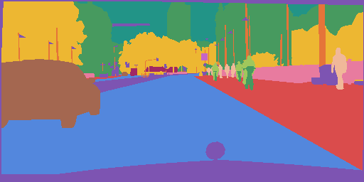
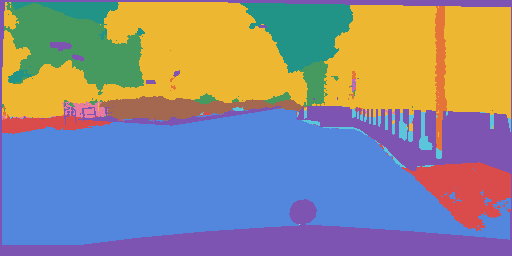
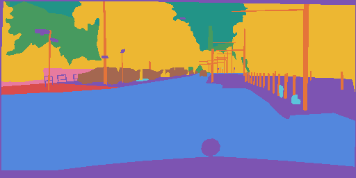
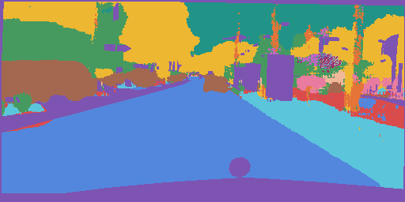
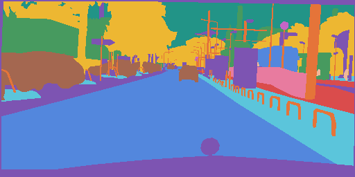
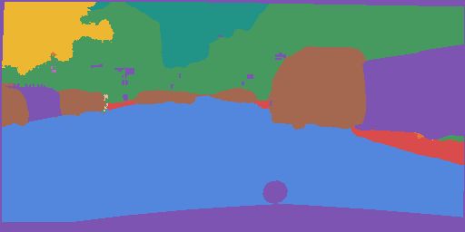
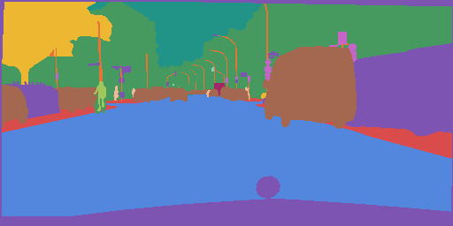

# AGV DL Segmentation Pipeline

## Structure

```bash
├── config  
│   ├── vanilla_enet.json
├── data
├── dataloader
│   ├── __init__.py
│   ├── cityscapes.py
├── models
│   ├── __init__.py
│   ├── enet.py
├── utils
│   ├── __init__.py
│   ├── augmentation.py
│   ├── config.py
│   ├── device.py
│   ├── losses.py
│   ├── metric.py
│   ├── preprocessing.py
│   ├── saving.py
│   ├── scripts.py
│   ├── tester.py
│   ├── trainer.py
│   ├── wandb_utils.py
├── __init__.py
├── README.md
├── run.py
├── test.py
├── train.py              
```


## Usage

### Downloading Data

```bash
wget --keep-session-cookies --save-cookies=cookies.txt --post-data 'username=username&password=pass&submit=Login' https://www.cityscapes-dataset.com login/
wget --load-cookies cookies.txt --content-disposition https://www.cityscapes-dataset.com/file-handling/?packageID=1
unzip -q -o gtFine_trainvaltest.zip
wget --load-cookies cookies.txt --content-disposition https://www.cityscapes-dataset.com/file-handling/?packageID=3
unzip -q -o leftImg8bit_trainvaltest.zip
```

### Training and Testing

```bash
python3 run.py [-h] [--config CONFIG_FILE] [--mode MODE]
                    [--wandb_id "WANDB_API_KEY"]
```

## Results

### Mean Accuracy and IoU

| Experiment           | Training Mean IoU | Validation Mean IoU | Training Mean Accuracy | Validation Mean Accuracy |
|----------------------|-------------------|---------------------|------------------------|--------------------------|
| Weighted CutMix ENet | 0.62              | 0.57                | 0.66                   | 0.63                     |
| CutMix ENet          | 0.60              | 0.52                | 0.73                   | 0.69                     |
| Vanilla ENet         | 0.56              | 0.48                | 0.70                   | 0.66                     |

### Segmented Images

<div>


</div>

<div>


</div>

<div>


</div>

<div>


</div>

## Contributors

This repository is maintained by [AGV (IIT Kharagpur)](http://www.agv.iitkgp.ac.in/)

## Refrences

- The Cityscapes Dataset for Semantic Urban Scene Understanding: [Link](https://arxiv.org/pdf/1604.01685.pdf)
- ENet: A Deep Neural Network Architecture for Real-Time Semantic Segmentation: [Link](https://arxiv.org/pdf/1606.02147.pdf)
- CutMix: Regularization Strategy to Train Strong Classifiers with Localizable Features: [Link](https://arxiv.org/pdf/1905.04899.pdf)